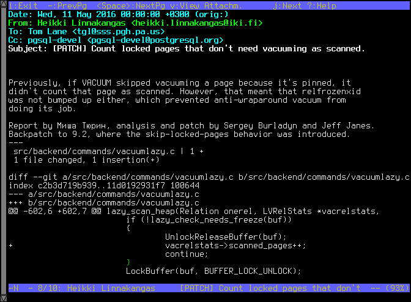
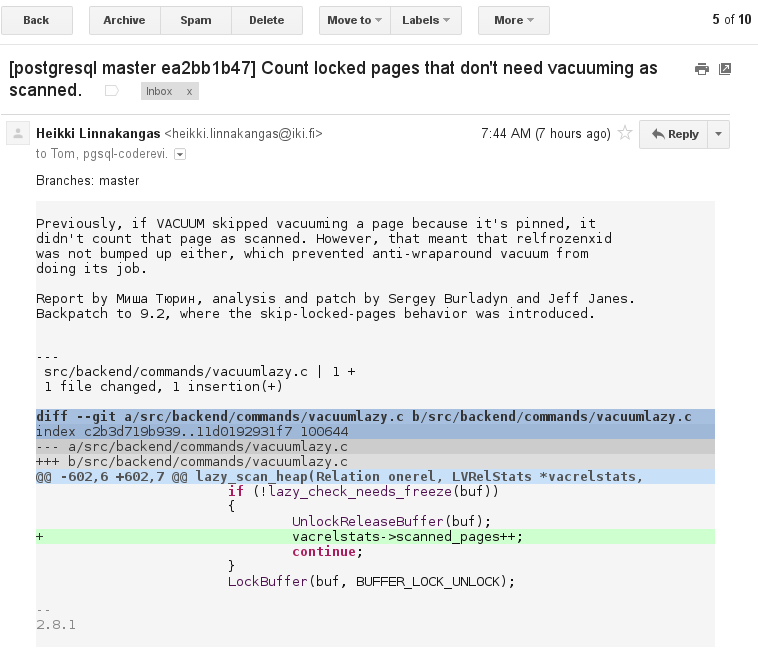
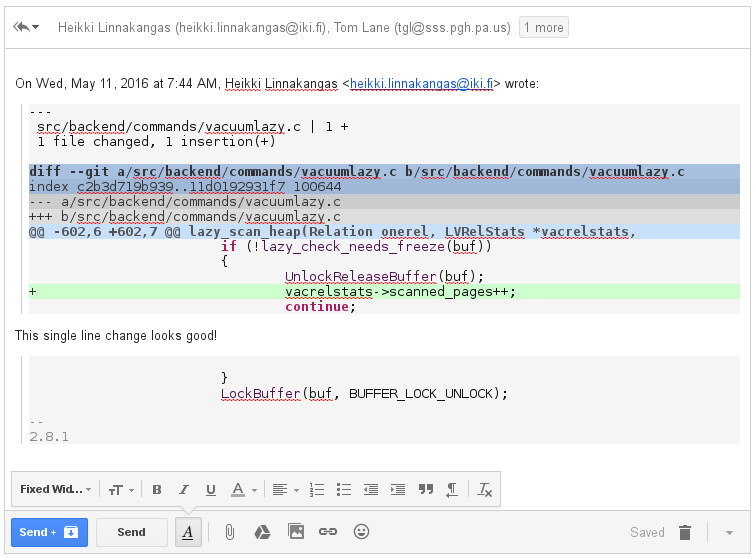
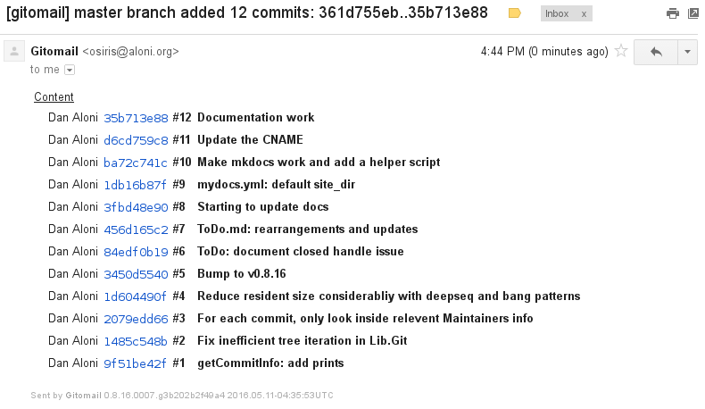
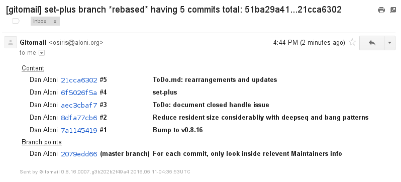

# Gitomail

Gitomail is a tool for generating pretty inline-HTML emails for [Git](https://git-scm.com/) commits, with a sending capability to proper recipients.

This page provides a short introduction to Gitomail's main features.

## First, some history

Many years before [Git](https://git-scm.com/) became popular or existed, people were using mailing lists in order to collaborate on code changes. The unified diff format, now popularized, as used as a diff format in the Plain Text-formatted emails. A text-based console email program such as [mutt](http://www.mutt.org/) presented the user a convinent way to handle these diffs and import them into their source trees.

Below is a fake example of such an email, based on a commit in the PostgreSQL project:


**(shown here above, a screenshot from an old email reader)**


With the advant of sites like [Github](https://github.com), email became under-used for reviewing changes, and in the Webmail era, emails containing diffs may appear somewhat arcane to developers of today.

## Diffs in the age of Webmail

Nowadays, the Plain Text version of the email message seems outdated. This is where Gitomail comes into the picture.

For example, the email from above, when sent by Gitomail, can appear like the following:



Combined with full syntax highlighting, the HTML part of the email makes this appearance possible.

## Inline reply friendliness

Similarly to Plain Text emails, it's possible to reply to changes inline:



## Branch change summaries

Gitomail tracks changes to branches, and can describe what changed, dealing properly with fast-forward and rebases. It's possible to specify how branches relate to each so that summaries make sense.

### Fast forward example



### Rebase example



## Automatic recipients and code maintainership

Of course, it is not enough to format the emails. We would also like to designate their recipients, preferrably in an automated way.

Inspired by a very wonderful script in the Linux kernel source tree named [get_maintainers.pl](https://github.com/torvalds/linux/blob/master/scripts/get_maintainer.pl), Gitomail supports its own [Maintainers file format](maintainers-spec.md), which can specify rules to match people to certain files or directories.

```python
maintainer dan file.*
maintainer jack Makefile
reviewer mailinglist
```

Using a very minimal specification language, and formatted similarly to `.gitignore`, these `Maintainers` files can optionally spread across the source tree, assigning code to maintainers. It's especially useful for single repositories bearing multiple maintainers of code. These files are then used to automatically set the destination address of emails to the rightful maintainers, based on the code changed in the commit, effectively working very similar to [get_maintainers.pl](https://github.com/torvalds/linux/blob/master/scripts/get_maintainer.pl).
