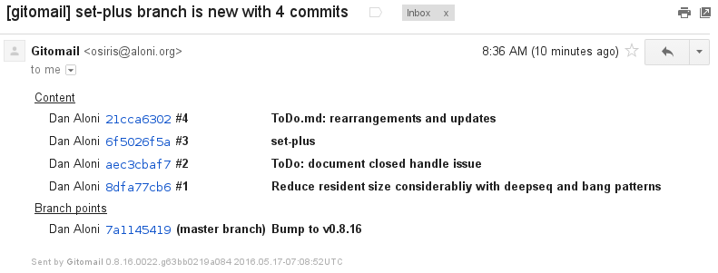
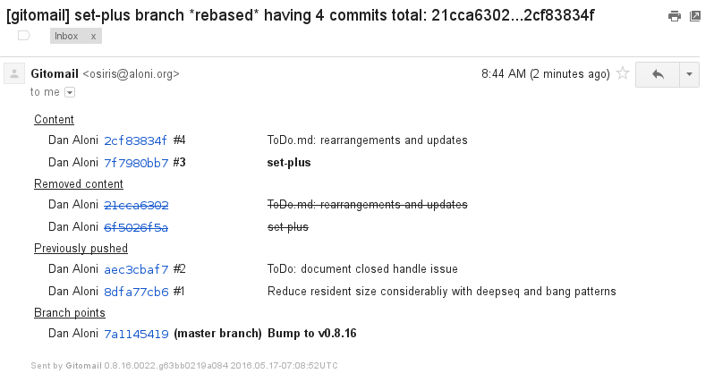

# Similar Commits Detection

Many teams working with with Git often [rebase their history](https://www.atlassian.com/git/tutorials/merging-vs-rebasing) between reviews, and before pushing their work to to shared branches. In teams where there is not a single person in charge of 'pulling' and doing integration, this helps keep the shared history linear, with little to no changes hidden inside merge commits, and overall history tidyness is improved.

However, when commits are being rebased and possibly modified, it's hard to do a 'second order diff' to see what changed in the commit diff itself.

To solve this one of the features of Gitomail is the detection of commits that look similar to previous posted ones. It does so by calculating a hash over each of the commit diffs, after stripping line numbers. When a branch is rebased, only the commits that appear new are marked as bold. In addition, the mails sent for the identical commits are marked with the `InexactDiffDup` flag.

### Example

Suppose a new branch was pushed. The summary mail will appear as such:

But later it was re-pushed, with a single commit being modified. Only that commit will be marked as bold:

Gitomail does not resend emails if the commit hash did not change, as can be seen above for commits #1 and #2. For commit #3 and #4, the emails are resent, but #4 is flagged with `InexactDiffDup`.
